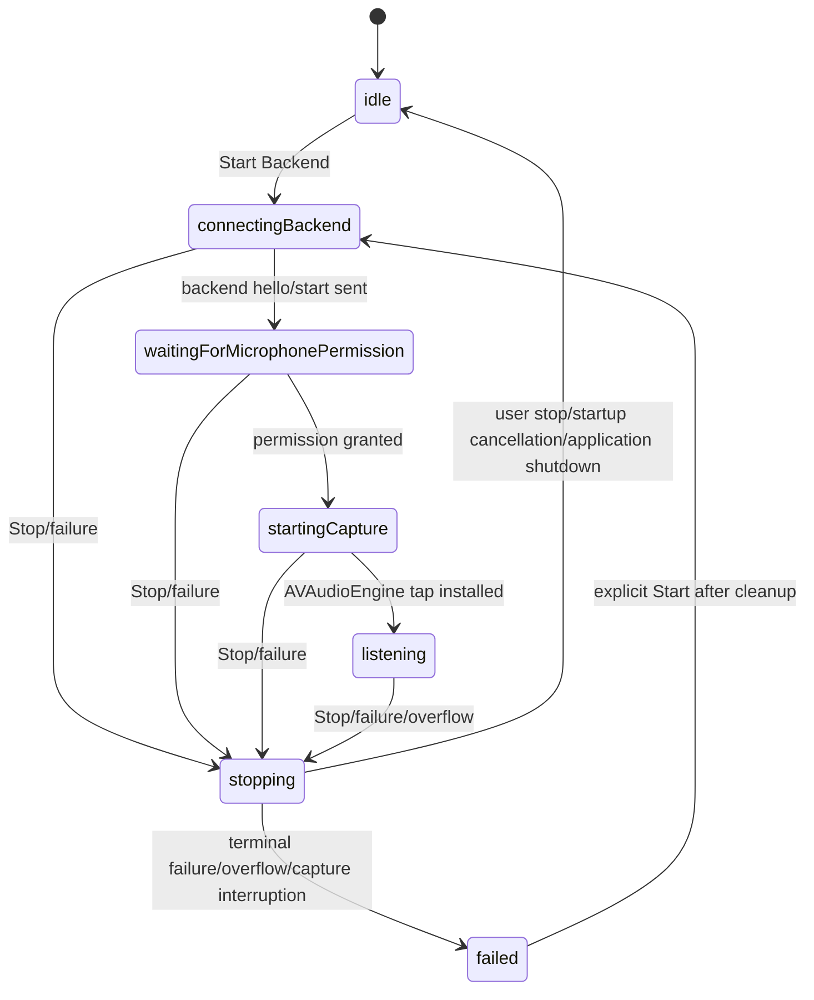

# P0.2 Session Ownership Report

Report date: 2026-06-19

## Initial State

- Required base commit: `f706257a6c3735795b05c88a3bc17c47157ed380`.
- Actual HEAD at start: `f706257 Fix P0.1 microphone session reliability`.
- Branch: `main`, tracking `origin/main`.
- Working tree at start: clean.

## Baseline Commands

| Command | Exit | Result |
| --- | ---: | --- |
| `git status -sb` | 0 | `## main...origin/main` |
| `git log --oneline --decorate -10` | 0 | HEAD is `f706257`; previous commits are `32917d4`, `8782133`, `1cedd54`. |
| `git show --stat --oneline HEAD` | 0 | Confirmed P0.1 microphone session reliability commit. |
| `git diff --check` | 0 | No whitespace errors before editing. |

## Confirmed Defects

- `ApplicationController` owned backend session resources as separate mutable properties, so stale cleanup could read references belonging to a newer session.
- `session_state.ready` could move `runState` to `connected` before microphone permission and capture startup completed.
- `MicrophoneAudioCaptureService.start` requested permission and installed the input tap in one async operation, so Stop during the permission prompt could not invalidate startup before capture.
- `BoundedAudioChunkPipe` did not synchronize all mutable state and did not fail closed synchronously on overflow.
- `AudioStreamCoordinator` had no session invalidation token and could commit after overflow or Stop if events arrived after invalidation.
- Backend `stop_stream` could double-clear after a prior `utterance_cancel`.
- Backend correlation treated `commitRequested` cleanup as ordinary cancellation instead of abandonment.
- Realtime send failures were not caught, and queued events were removed before successful flush.
- Backend session termination did not consistently prevent late Realtime events, Responses calls, or blind sends to a closing WebSocket.
- `server/tsconfig.json` typechecked only source files, not tests.
- `docs/architecture.md` still claimed bounded automatic reconnect with jitter, which is not implemented.

## Session Ownership Design

P0.2 uses one generation-bound `BackendMicrophoneSessionContext` per backend microphone session. The context owns:

- immutable generation UUID;
- immutable backend session UUID;
- one `BackendWebSocketClient`;
- one `AudioStreamCoordinator`;
- one `MicrophoneCaptureServiceProtocol`;
- one `BoundedAudioChunkPipe`;
- one receive task;
- one audio-processing task;
- one shared cleanup task;
- one `SessionInvalidationToken`.

`ApplicationController` keeps only `currentSession` for backend microphone resources. Startup, receive, processing, overflow, fatal-error, stop, and termination paths pass the exact context they own. A stale context is ignored unless it is completing its own cleanup and `currentSession` is still that exact object.

## Session Lifecycle State Diagram

`session_state.ready` means only that the backend protocol session is ready. It no longer enables Start or marks microphone capture as running.

## Overflow Invalidation Design

`BoundedAudioChunkPipe` now protects `continuation`, finished state, and overflow state with a lock. On the first dropped element it:

- invalidates the session token synchronously as `audioPipelineOverflow`;
- marks the pipe finished;
- finishes the stream;
- rejects later `yield` calls with `.terminated`;
- invokes the overflow callback once.

`AudioStreamCoordinator` checks the invalidation token before `utterance_start`, before every audio frame, before `utterance_commit`, and after awaited WebSocket operations. Once invalidated, ordinary processing cannot start a new utterance, send more audio, or commit. Cleanup can still call `cancelActiveUtterance` exactly once for a cancellable active utterance.

## Backend Lifecycle Changes

Backend P0.2 changes:

- `UtteranceCorrelationStore` validates commit sequence and duplicate `ended_at_ms`.
- Active utterances can be cancelled; `commitRequested` and `correlated` records become `abandoned` on session termination.
- Abandoned records cannot later correlate, complete, translate, or replay.
- Normal `utterance_cancel -> stop_stream -> close` produces one Realtime clear and one Realtime close.
- Repeated `stop_stream` and `manager.close()` are idempotent.
- Realtime malformed JSON, OpenAI error events, queue overflow, and synchronous `socket.send` failures are terminal.
- Terminal Realtime failure emits fatal `realtime_session_failed`, closes the Realtime client, terminates the client WebSocket, and requires explicit user restart.
- `safeSend`/`safeClose` prevent blind sends to closing/closed sockets.
- Late Realtime events and in-flight Responses results are ignored after termination.
- Source and test TypeScript are both covered by `npm run typecheck`.

## Files Changed

Modified:

- `README.md`
- `docs/acceptance-report.md`
- `docs/architecture.md`
- `docs/manual-macos-test-checklist.md`
- `docs/p0-microphone-report.md`
- `docs/protocol.md`
- `macos/LiveOverlayTranslator/Sources/LiveOverlayTranslator/ApplicationController.swift`
- `macos/LiveOverlayTranslator/Sources/LiveOverlayTranslator/LiveOverlayTranslatorApp.swift`
- `macos/LiveOverlayTranslator/Sources/LiveOverlayTranslator/MicrophoneAudioCaptureService.swift`
- `macos/LiveOverlayTranslator/Sources/LiveOverlayTranslatorCore/AudioCaptureService.swift`
- `macos/LiveOverlayTranslator/Sources/LiveOverlayTranslatorCore/AudioStreamCoordinator.swift`
- `macos/LiveOverlayTranslator/Sources/LiveOverlayTranslatorCore/BoundedAudioChunkPipe.swift`
- `macos/LiveOverlayTranslator/Tests/LiveOverlayTranslatorTests/BoundedAudioChunkPipeTests.swift`
- `server/package.json`
- `server/src/openai/OpenAIRealtimeTranscriptionClient.ts`
- `server/src/server.ts`
- `server/src/services/UtteranceCorrelationStore.ts`
- `server/src/ws/ClientSessionManager.ts`
- `server/tests/clientSessionManager.test.ts`
- `server/tests/correlation.test.ts`
- `server/tests/openAIRealtimeClient.test.ts`

Created:

- `docs/p0-2-session-ownership-report.md`
- `macos/LiveOverlayTranslator/Sources/LiveOverlayTranslatorCore/BackendMicrophoneSessionContext.swift`
- `macos/LiveOverlayTranslator/Sources/LiveOverlayTranslatorCore/SessionInvalidationToken.swift`
- `macos/LiveOverlayTranslator/Tests/LiveOverlayTranslatorTests/AudioStreamCoordinatorTests.swift`
- `macos/LiveOverlayTranslator/Tests/LiveOverlayTranslatorTests/BackendMicrophoneSessionContextTests.swift`
- `server/src/ws/safeWebSocket.ts`
- `server/tests/safeWebSocket.test.ts`
- `server/tsconfig.tests.json`

## Tests Added

- Backend lifecycle tests for double-clear prevention, repeated stop idempotency, commit sequence mismatch, conflicting duplicate commit metadata, terminal Realtime failure, and in-flight Responses suppression after termination.
- Backend correlation tests for commit metadata validation and abandoned post-commit records.
- Backend Realtime tests for malformed JSON terminal behavior and synchronous send failures during queued flush and ordinary append.
- Backend safe WebSocket helper tests for closing sockets, synchronous send throws, and idempotent close.
- Swift Core tests for session invalidation token, pipe overflow fail-closed behavior, yield after invalidation, yield/finish thread-safety, coordinator no-commit-after-invalidation, coordinator stop disconnect on stop_stream failure, and Core session context ownership.

## Validation

| Command | Exit | Result |
| --- | ---: | --- |
| `git status -sb` | 0 | Initial status clean: `## main...origin/main`. |
| `git log --oneline --decorate -10` | 0 | Initial HEAD `f706257`. |
| `git show --stat --oneline HEAD` | 0 | Confirmed P0.1 base commit. |
| `git diff --check` | 0 | Baseline whitespace clean. |
| `npm test -- tests/correlation.test.ts tests/clientSessionManager.test.ts tests/openAIRealtimeClient.test.ts tests/safeWebSocket.test.ts` | 1 | RED run failed 11 tests plus missing `safeWebSocket` module as expected. |
| same targeted backend command | 0 | GREEN run passed: 4 files, 33 tests. |
| `npm run typecheck` | 2 | RED after adding test typecheck: test callbacks returned `number` from `messages.push`. |
| `npm run typecheck` | 0 | Source and test TypeScript passed. |
| `npm ci` | 0 | Installed dependencies; warning only: current Node `v23.10.0` is outside Vitest's declared `^20 || ^22 || >=24` engine range. |
| `npm run typecheck` | 0 | Final source and test TypeScript passed. |
| `npm test` | 0 | Final backend suite passed: 11 files, 51 tests. |
| `npm run build` | 0 | Backend production TypeScript build passed. |
| `env CLANG_MODULE_CACHE_PATH=/private/tmp/liveoverlay-clang-cache SWIFT_MODULE_CACHE_PATH=/private/tmp/liveoverlay-swift-cache swift build` | 0 | Swift package build passed. |
| same environment with `swift test` | 1 | Blocked before execution by local toolchain: `no such module 'Testing'`. Swift executed test count: 0. |
| `xcodebuild -list -project LiveOverlayTranslator.xcodeproj` | 1 | Blocked: active developer directory is Command Line Tools, not full Xcode. |
| `xcodebuild -project LiveOverlayTranslator.xcodeproj -scheme LiveOverlayTranslator -configuration Debug -derivedDataPath /tmp/LiveOverlayTranslatorDerivedData CODE_SIGNING_ALLOWED=NO build` | 1 | Same full-Xcode environment blocker. |
| final `git diff --check` | 0 | No whitespace errors. |
| placeholder scan with `rg` | 1 | No `TODO`, `TBD`, or `Pending final update` placeholders in updated public docs/report. |
| secret/unsafe-claim scan with `rg` | 1 | No OpenAI key patterns or unsafe system-audio/Clean Share/reconnect claims found. |

Physical-Mac tests performed: none in this environment.

## Current Readiness

- Local Mock: READY for automated mock flow; no microphone/backend/API key required.
- Backend Mock microphone: READY for automated backend/macOS build coverage; still needs physical Mac runtime smoke for microphone hardware behavior.
- Real OpenAI microphone: NOT READY for production; backend path is tested, but physical Mac + real Realtime validation was not performed.
- System audio: NOT READY and explicitly unavailable.
- Clean Share: NOT READY and explicitly unavailable.
- Production use: NOT READY; physical microphone, sleep/wake, device disconnect, full Xcode build, notarization, WSS deployment, and privacy/manual checks remain.
